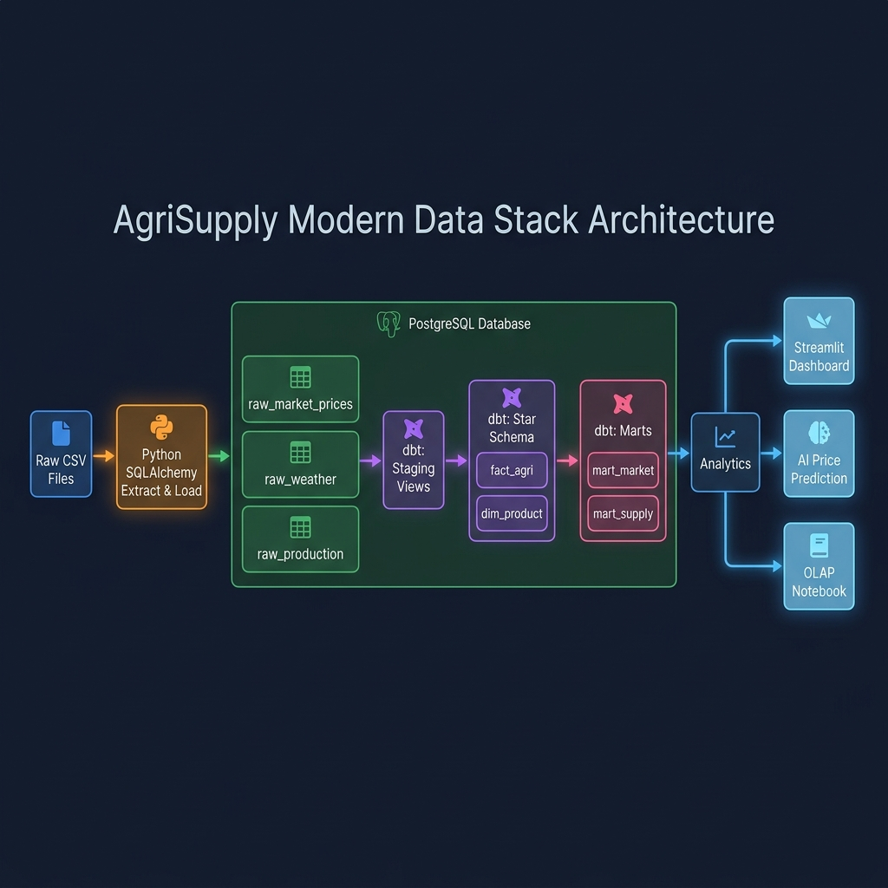

# AgriSupply Data Warehouse Architecture

This document describes the architectural flow, component relationships, and data lifecycle for the AgriSupply data warehouse.

## System Architecture Diagram


## Star Schema Data Model


## System Architecture Overview



## Overview
The AgriSupply Data Warehouse is a **Modern Data Stack (MDS)** built on PostgreSQL and dbt. It integrates agricultural source data through a clean ELT pipeline into a consistent Star Schema model for reporting, exploration, and predictive analytics.

The system supports:
- Kenya-wide crop price analysis across 5 regions
- Production monitoring and harvest volume tracking
- Weather impact correlation analysis (rainfall vs. pricing)
- Regional performance comparison

## Architecture Flow

```
Raw CSV Files
    └─→ src/elt/extract_load_db.py   [Python + SQLAlchemy]
            └─→ PostgreSQL: raw_market_prices, raw_weather, raw_production
                    └─→ dbt: stg_* Views (validate + standardize)
                            └─→ dbt: fact_agri + dim_product (Star Schema)
                                    └─→ dbt: mart_market, mart_supply (Aggregated Marts)
                                            └─→ Streamlit Dashboard, OLAP Notebook, AI Mining
```

## Supporting Project Areas

### ELT Engine
- `src/elt/extract_load_db.py` — SQLAlchemy bulk loads raw CSVs directly into PostgreSQL

### dbt Transformation Models
- `dbt_project/models/staging/` — staging views (validate, clean, type-cast)
- `dbt_project/models/warehouse/` — star schema tables (fact_agri, dim_product)
- `dbt_project/models/marts/` — business aggregation tables (mart_market, mart_supply)

### SQL Support
- `sql/olap/` — advanced CUBE, ROLLUP, GROUPING SETS queries
- `sql/metadata/` — operational audit trail DDL (etl_job_execution table)

### Application Logic
- `src/elt/` — extract and load runner
- `src/mining/` — AI price prediction model querying fact_agri
- `src/metadata/` — pipeline execution logger writing to PostgreSQL

## Design Principles
- **ELT over ETL:** Transformation happens inside the database via dbt
- **Metadata as Code:** Data lineage and ownership defined in `sources.yml`
- **Single Source of Truth:** PostgreSQL is the only data store — no intermediate CSVs
- **Reproducible:** One command runs the entire pipeline from raw to mart

