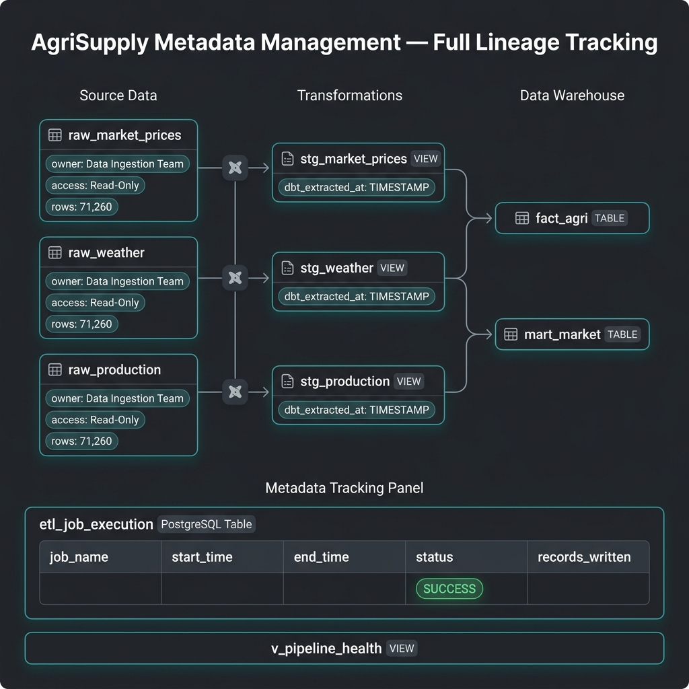

# Data Identification

## Purpose
This document formally identifies all data sources used in the AgriSupply Data Warehouse. It captures field-level metadata, data types, constraints, grain definitions, volume actuals, and quality expectations for each source dataset.

**Last updated:** 2026-04-06
**Data generation script:** `scripts/generate_raw_data.py`

---

## Source 1 — Market Prices

### Source Metadata
| Property        | Value |
|----------------|-------|
| Source name    | Market Prices |
| File           | `data/raw/market_prices/market_prices.csv` |
| Format         | CSV (UTF-8) |
| Update cadence | Daily |
| Date range     | 2020-01-01 to 2025-12-31 (6 years) |
| Grain          | One record per `date + product + region` |
| **Actual rows**| **54,800** |

### Fields
| Field    | Data Type | Nullable | Description                          | Example Value |
|---------|-----------|----------|--------------------------------------|---------------|
| date    | DATE      | No       | Transaction date (YYYY-MM-DD)        | 2023-06-15    |
| product | VARCHAR   | No       | Crop/commodity name (lowercase)      | maize         |
| region  | VARCHAR   | No       | Administrative region name           | Nairobi       |
| price   | DECIMAL   | No       | Market price in KES per unit         | 58.42         |

### Business Rules
- `price` must be > 0
- `date` must be within the 2020–2025 range
- `region` must be one of the 5 master regions
- `product` must be one of the 5 master products

### Price Characteristics
| Product  | Approx. Base (KES) | Seasonal Pattern | Annual Drift |
|---------|-------------------|------------------|--------------|
| maize   | 50                | Peaks mid-year   | +2.5/yr      |
| beans   | 100               | Peaks mid-year   | +3.0/yr      |
| tomatoes| 80                | Peaks mid-year   | +4.0/yr      |
| potatoes| 60                | Peaks mid-year   | +2.0/yr      |
| wheat   | 70                | Peaks mid-year   | +3.5/yr      |

---

## Source 2 — Weather Data

### Source Metadata
| Property        | Value |
|----------------|-------|
| Source name    | Weather Data |
| File           | `data/raw/weather/weather.csv` |
| Format         | CSV (UTF-8) |
| Update cadence | Daily |
| Date range     | 2020-01-01 to 2025-12-31 (6 years) |
| Grain          | One record per `date + region` |
| **Actual rows**| **10,960** |

### Fields
| Field       | Data Type | Nullable | Description                       | Example Value |
|------------|-----------|----------|-----------------------------------|---------------|
| date       | DATE      | No       | Observation date (YYYY-MM-DD)     | 2023-06-15    |
| region     | VARCHAR   | No       | Administrative region name        | Meru          |
| temperature| DECIMAL   | No       | Average daily temperature (°C)   | 21.3          |
| rainfall   | DECIMAL   | No       | Total daily rainfall (mm)         | 12.8          |

### Business Rules
- Temperature range: 5°C to 40°C — outside this indicates a data error
- Rainfall must be >= 0
- `region` must be one of the 5 master regions

### Climate Profiles (by region)
| Region  | Base Temp (°C) | Wet Season Months         | Avg Rain Event (mm) |
|--------|----------------|---------------------------|---------------------|
| Nairobi | 22.0          | Mar–May, Oct–Nov          | 12                  |
| Eldoret | 18.0          | Mar–May, Aug–Oct          | 15                  |
| Kisumu  | 27.0          | Mar–May, Oct–Nov          | 14                  |
| Meru    | 21.0          | Mar–Apr, Oct–Nov          | 18                  |
| Nakuru  | 19.5          | Mar–May, Oct–Nov          | 10                  |

### Known Transformation Requirement
Weather is at **`date + region`** grain. To join with the warehouse fact table (`date + product + region`), weather rows must be **fanned out** to the product level during the staging/ODS transformation.

---

## Source 3 — Production Data

### Source Metadata
| Property        | Value |
|----------------|-------|
| Source name    | Production Data |
| File           | `data/raw/production/production.csv` |
| Format         | CSV (UTF-8) |
| Update cadence | Every 10 days (snapshot) |
| Date range     | 2020-01-01 to 2025-12-31 (6 years) |
| Grain          | One record per `date + product + region` |
| **Actual rows**| **5,500** |

### Fields
| Field    | Data Type | Nullable | Description                               | Example Value |
|---------|-----------|----------|-------------------------------------------|---------------|
| date    | DATE      | No       | Snapshot or harvest date (YYYY-MM-DD)     | 2023-06-15    |
| product | VARCHAR   | No       | Crop name (lowercase)                     | potatoes      |
| region  | VARCHAR   | No       | Administrative region name                | Nakuru        |
| quantity| INTEGER   | No       | Quantity produced (metric tons)           | 1142          |

### Business Rules
- `quantity` must be >= 50 (minimum viable harvest)
- `region` must be one of the 5 master regions
- `product` must be one of the 5 master products

### Production Profiles (by product)
| Product  | Base Qty (MT) | Seasonal Peak  | Peak Region  |
|---------|--------------|----------------|--------------|
| maize   | 1,000        | Aug–Oct        | Eldoret      |
| beans   | 500          | Aug–Oct        | Eldoret      |
| tomatoes| 800          | Aug–Oct        | Kisumu       |
| potatoes| 700          | Aug–Oct        | Nakuru       |
| wheat   | 600          | Aug–Oct        | Nakuru       |

---

## Master Reference Lists

### Products (5 total)
| product_name |
|-------------|
| maize       |
| beans       |
| tomatoes    |
| potatoes    |
| wheat       |

> **Note:** Product names are stored in lowercase in raw CSV files. Standardize to title case (e.g. `Maize`) during staging.

### Regions (5 total)
| region_name | country | Altitude   | Climate Zone         |
|------------|---------|------------|----------------------|
| Nairobi    | Kenya   | 1,795 m    | Highland subtropical |
| Eldoret    | Kenya   | 2,100 m    | Highland cool        |
| Kisumu     | Kenya   | 1,131 m    | Lakeside tropical    |
| Meru       | Kenya   | 1,500 m    | Mid-elevation        |
| Nakuru     | Kenya   | 1,850 m    | Rift Valley highland |

---

## Actual Data Volumes

| Dataset        | Rows (Actual) | Grain                        | Date Range    |
|---------------|--------------|------------------------------|---------------|
| Market Prices  | **54,800**   | daily · product · region     | 2020–2025     |
| Weather        | **10,960**   | daily · region               | 2020–2025     |
| Production     | **5,500**    | every 10 days · product · region | 2020–2025 |
| **TOTAL**      | **71,260**   |                              |               |

---

## Mapping to Warehouse Grain

The warehouse fact table `fact_agri` operates at grain: **`date + product + region`**

| Source         | Raw Grain                   | Matches WH Grain? | Transformation Needed                                  |
|---------------|-----------------------------|--------------------|--------------------------------------------------------|
| Market Prices  | date + product + region     | ✅ Direct match   | Standardize product name casing                        |
| Production     | date + product + region     | ✅ Direct match   | Standardize product name casing; interpolate dates if needed |
| Weather        | date + region               | ⚠️ Partial match  | Fan-out to each product per date+region during staging |

---

## Data Quality Expectations

| Check                        | Dataset(s)          | Rule                                     |
|-----------------------------|---------------------|------------------------------------------|
| No null keys                | All                 | date, region, product must be non-null   |
| Price range                 | Market Prices       | price between 5 and 500 KES              |
| Temperature range           | Weather             | temperature between 5°C and 40°C         |
| Rainfall non-negative       | Weather             | rainfall >= 0                             |
| Quantity minimum            | Production          | quantity >= 50 MT                        |
| Region conformance          | All                 | region IN (Nairobi, Eldoret, Kisumu, Meru, Nakuru) |
| Product conformance         | Market Prices, Production | product IN (maize, beans, tomatoes, potatoes, wheat) |
| No duplicate grain          | All                 | No duplicate (date, product, region) per file |

---

## Metadata & Lineage Tracking

All source table lineage, data ownership, and transformation history is tracked through two systems:

1. **dbt `sources.yml`** — Documents each raw table with `owner`, `description`, `access_pattern` metadata. Running `dbt docs generate` generates a live interactive lineage site.
2. **`etl_job_execution` PostgreSQL table** — Logs every pipeline run with `start_time`, `end_time`, `status`, `records_written`. Queryable via `v_pipeline_health` view.

## Completion Status

- [x] Define source fields, types, and constraints
- [x] Confirm actual data volumes (71,260 rows across 3 sources)
- [x] Establish master region and product lists
- [x] Staging validation handled by dbt `stg_*` views in PostgreSQL
- [x] ELT script ingests CSVs directly to raw DB tables (`src/elt/extract_load_db.py`)
- [x] Warehouse fact and dimension tables materialized by dbt (`fact_agri`, `dim_product`)

