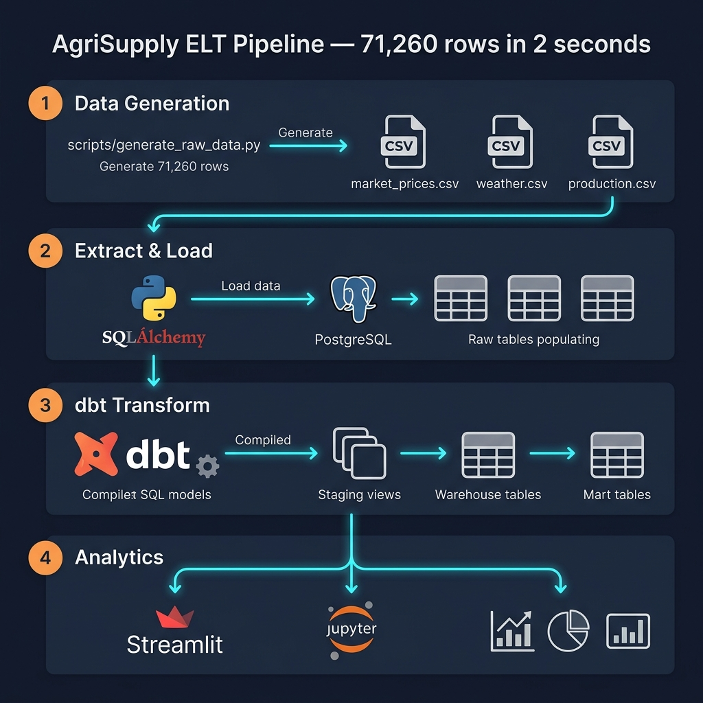

# Pipeline Flow

## Overview
This document describes the complete data flow through the AgriSupply Data Warehouse, from synthetic raw data generation through to the final PostgreSQL mart layer driven by dbt.



---

## Full Pipeline (ELT Architecture)

```
scripts/generate_raw_data.py
        │
        ▼
data/raw/
  ├── market_prices/market_prices.csv   [54,800 rows]
  ├── weather/weather.csv               [10,960 rows]
  └── production/production.csv         [ 5,500 rows]
        │
        ▼ 
[ PHASE 1: Python Extract & Load (SQLAlchemy) ]
src/etl/extract_load_db.py
  - Reads raw CSVs into memory
  - Creates SQL Engine via URL connection
  - Lands all 71,260 rows directly into PostgreSQL
        │
        ▼
PostgreSQL Schema: public (Raw Tables)
  ├── raw_market_prices 
  ├── raw_weather         
  └── raw_production      
        │
        ▼
[ PHASE 2: Transform (dbt run) ]
dbt_project/models/staging/
  - stg_market_prices.sql (Cleans strings, sets data types)
  - stg_weather.sql
  - stg_production.sql
        │
        ▼
dbt_project/models/warehouse/
  - dim_product.sql (Extracts unique products)
  - fact_agri.sql (Joins prices, weather, and production via surrogate keys)
        │
        ▼
dbt_project/models/marts/
  - mart_market.sql (Aggregates prices to monthly level)
  - mart_supply.sql (Aggregates supply volume to monthly level)
        │
        ▼
dashboards/
  └── app.py (Streamlit dashboard reading natively from mart_market & mart_supply)
```

---

## Stage Details

### Stage 1 — Data Generation
| Script | `scripts/generate_raw_data.py` |
|---|---|
| Input | None (synthetic generation) |
| Output | 3 raw CSV files in `data/raw/` |
| Total rows | 71,260 |

### Stage 2 — Extract & Load (EL)
| Script | `src/etl/extract_load_db.py` |
|---|---|
| Input | `data/raw/` CSVs |
| Output | PostgreSQL tables (`raw_market_prices`, `raw_weather`, `raw_production`) |
| Mechanism | Pandas `.to_sql()` utilizing raw SQLAlchemy Postgres connections |

### Stage 3 — Transform (T)
| Engine | `dbt run` |
|---|---|
| Input | `public.raw_*` tables |
| Output | `public.stg_*` views, `public.dim_*` tables, `public.fact_*` tables |
| Key transforms | Surrogate key assignment, grain alignment, Star Schema generation, Mart aggregations |

---

## Run the Full Pipeline

```bash
# Run both EL and T stages
python pipelines/run_pipeline.py
```

---

## Data Volume Summary

| Layer         | PostgreSQL Object                  | Total Rows |
|--------------|--------------------------------|-----------|
| Raw          | raw_market_prices, raw_weather, raw_production | 71,260 |
| Staging      | stg_market_prices, stg_weather, stg_production | 71,260 |
| Warehouse    | fact_agri + dim_product       | 54,800 fact rows    |
| Marts        | mart_market, mart_supply       | Variable (Aggregated)     |
