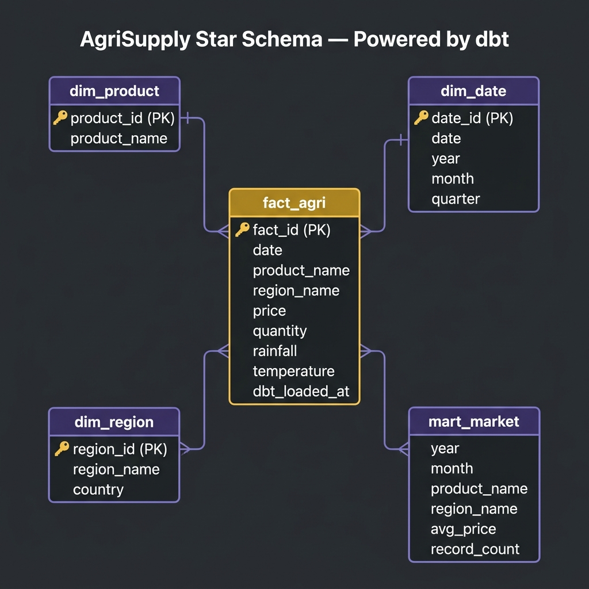

# Schema Design

## Overview
The warehouse uses a **dbt-native** star schema to support fast analytical queries and simple business reporting. All tables are materialized directly inside PostgreSQL — no CSVs, no local files.

---

## Warehouse Grain

The main fact table is defined at:

> **One record per `(date, product, region)`**

---

## Fact Table

### fact_agri

| Column      | Type    | Description                        |
|------------|---------|-------------------------------------|
| date_id    | INTEGER | FK → dim_date                      |
| product_id | INTEGER | FK → dim_product                   |
| region_id  | INTEGER | FK → dim_region                    |
| price      | DECIMAL | Market price of product (KES)      |
| quantity   | INTEGER | Production quantity (metric tons)  |
| rainfall   | DECIMAL | Daily rainfall (mm)                |
| temperature| DECIMAL | Daily temperature (°C)             |

---

## Dimension Tables

### dim_date
| Column   | Type    | Description        |
|---------|---------|--------------------|
| date_id | INTEGER | Primary key        |
| date    | DATE    | Full date          |
| day     | INTEGER | Day of month       |
| month   | INTEGER | Month number       |
| year    | INTEGER | Year               |
| quarter | INTEGER | Quarter (1–4)      |
| week    | INTEGER | ISO week number    |

### dim_product
| Column       | Type    | Description          |
|-------------|---------|----------------------|
| product_id  | INTEGER | Primary key          |
| product_name| VARCHAR | Name of the product  |

**Seed values:**
| product_id | product_name |
|-----------|-------------|
| 1         | Maize       |
| 2         | Beans       |
| 3         | Tomatoes    |
| 4         | Potatoes    |
| 5         | Wheat       |

### dim_region
| Column      | Type    | Description              |
|------------|---------|--------------------------|
| region_id  | INTEGER | Primary key              |
| region_name| VARCHAR | Name of region           |
| country    | VARCHAR | Country name             |

**Seed values:**
| region_id | region_name | country |
|----------|-------------|---------|
| 1        | Nairobi     | Kenya   |
| 2        | Eldoret     | Kenya   |
| 3        | Kisumu      | Kenya   |
| 4        | Meru        | Kenya   |
| 5        | Nakuru      | Kenya   |

---

## Mart Layer

The warehouse feeds subject-oriented marts, including:

- **Market mart** — price trends, regional price comparisons, product price volatility
- **Supply mart** — production volumes, seasonal harvest patterns, regional output ranking
- **Weather mart** — rainfall impact analysis, temperature correlation with yields

These marts simplify reporting for dashboards and business analysis.

---

## Design Rationale
- Star schema keeps reporting queries simple and performant
- Fact and dimension separation improves readability and maintainability
- Shared dimensions support consistent slicing across all marts
- 5 regions × 5 products × 6 years provides a rich analytical surface for the demo
- The model is structured to be realistic enough to demonstrate ETL, OLAP, and dashboard patterns
